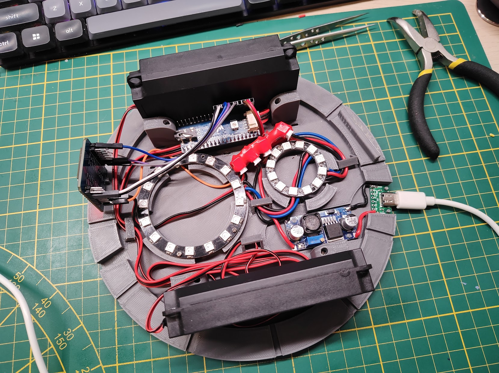

# RFID Jukebox

This is a variation on the topic of RFID Jukebox: scan an RFID tag or card,
and the music starts playing. Few bells and whistles are added, though.

If you look for "RFID jukebox" on the internet, you'll likely find dozens of
projects and builds, starting with the one on the [Home Assistant's blog](https://www.home-assistant.io/integrations/tag/#building-an-rfid-jukebox).
The idea is appealing, especially if this box is meant for a kid to use with
custom RFID cards.

Home Assistant's blog was about RFID tag readers. You'll find other projects
which integrate a tag reader with a speaker and an SD card to store the audio
files on. I tried something similar, didn't work out so well:

I had few extra requirements. I wanted this to be a:

- tag reader
- desk and/or night lamp
- clock

connected to my instance of Home Assistant. I also wanted this to be able to
stream audio from both local NAS and Spotify.

Idea is to have a set of RFID cards which can be scanned on the device. When
a card is scanned, the jukebox would send a [`tag_scanned` event](https://www.home-assistant.io/integrations/tag/#tag-scanned-events)
to the Home Assistant. This event would trigger an automation, which in turn
would play music.

So far, it's the same as the RFID jukebox described on the Home Assistant's
blog. And here comes the little extra: [Music Assistant](https://www.music-assistant.io/),
media library manager and streaming server. In their own words:

> The Music Assistant server is a free, opensource Media library manager that
> connects to your streaming services and a wide range of connected speakers.

Music Assistant makes it possible to stream a Spotify playlist to a connected
speaker when RFID card is scanned. It can also use local/network file systems
as a source, so it covers all cases.

Obviously, the same effect can be achieved if the tag was scanned by a phone
with the Home Assistant companion app, no need to build anything. But you know,
where's the fun in that?

It would also be fun if presence of the card would control the playback,
mimicking the behavior of CD, cassette tape, or vinyl players. Place a card
on the device - music starts. Remove it - music stops.

Since this is supposed to act also as a nightlight, some form of local control
is needed. Nobody really likes having to open an app to turn on the lights.
That's why this device uses a proven solution: **a button**[^1]. Pressing
the button would cycle the lights: low, medium, full brightness, rainbow
effect, off.

[^1]: It also doesn't require an internet connection to turn on the light.
Truly marvelous!

## Components & Supplies

I decided to go with the following components, mostly because I already had some
of them (they do fit surprisingly well, though):

- [Lilygo T-Embed](https://lilygo.cc/products/t-embed)
- [Muse Luxe](https://raspiaudio.com/product/esp-muse-luxe/) hackable, connected
  speaker, or any other speaker or audio system that can be [integrated with Home Assistant](https://www.home-assistant.io/integrations/?cat=media-player).
- PN532 RFID reader module (or any other [supported by ESPHome](https://esphome.io/components/#nfc-rfid))
- a couple of rings with WS2811 RGB addressable LEDs; I used:
    - 12 LED NeoPixel ring, 37mm diameter,
    - 16 LED NeoPixel ring, 68mm diameter
- LM2596S DC-DC step-down voltage converter module (like [this one](https://www.amazon.pl/dp/B089QJM8KQ?ref=ppx_yo2ov_dt_b_fed_asin_title&th=1))
- USB-C breakout board
- [semi-transparent PLA](https://anycubicofficial.pl/products/filament-pla?ref=upeeiins&variant=44750313718069)
- [regular PLA](https://anycubicofficial.pl/products/filament-pla?variant=44750313521461)
- assortment of wires

Note that except for the T-Embed dev board, you don't have to use the exact same
components from the list above. Design is flexible enough to accommodate
different hardware, as long it is supported by the software (Home Assistant,
ESPHome).

Even the T-Embed could be replaced by a similar development board, but it is
slightly trickier because part of the casing design would have to switched to
match the alternative module. Totally doable, though.

The voltage converter is adjusted to reduce and stabilize the output voltage at
approximately 4.2V-4.7V (it'll drop down even further when the LEDs are on)
from the 5V supplied by the USB. The converter's output is used to supply both
LEDs and the T-Embed module.

> [!NOTE]
> If you're using different ESP32 module, make sure that the output voltage
> of the converter is safe for that module.

The WS2811 LEDs can be supplied by voltages anywhere in the 3.3 - 5V range.
T-Embed is meant to be powered from a USB connection, so it expects input to
be at around 5V. It comes with its own voltage stabilizers dropping the voltage
down to 3.3V.

The RFID module and the LCD screen both require 3.3V, so they'll be powered
directly from the 3.3V pin on the T-Embed. They _probably could_ be connected
directly to voltage converter's output, but if you would like to do that,
make sure that modules you're using are 5V tolerant.

## 3D Prints

STL files with all the parts needed are downloadable here or from the project's
GitHub repository.

Parts are designed to have a tight fit, so it should be possible to assemble
everything without glue or screws. Still, ribs on the walls are designed to be
optionally attached to the base using small screws (M1.6 or so; not bolts, there
are no holes in the base).

## Assembly

Start with assembling the LED rings together: solder the power, ground, and data
wires between the two rings. There should be approximately 15mm of space between
the rings, enough to mount them to their stands on the base of the enclosure.

While soldering stuff, solder some wires between the USB breakout board and the
DC-DC converter. There's around 17mm between the two components, best use
~20mm wires. There's some space in the enclosure to align them.

Next, I would recommend to prepare a power extension cord of sorts. I used
JST connectors for power and ground, to avoid unfortunate accidents with
swapping power and ground pins. Take a few 2-pin JST sockets and connect
them together; maybe even wrap them in a heat shrink tube.

With the extension, you'll have plenty of power connectors to extend[^2] the
project in the future. Next, prepare ~50mm wires for power and ground outputs
from the converter and crimp a 2-pin JST connector on one end[^3]. Solder the other
end to the converter.

[^2]: An extension extends. Who'd knew.
[^3]: These things can also be purchased.

Now that it's been settled which pin is power and which is ground, you can
safely solder power connector to the LED ring assembly. Around 5cm should be
enough.

For the LED's `DI` pin, I'd suggest picking a longer, ~20cm female-female
wire (one for standard, 2.54mm gold pins), cutting it in half, and soldering
one of the laves to the LED ring.

If using the T-Embed module, that's the end of soldering. The LCD screen is
on board, and the RFID tag reader can be connected using those nifty jumper
wires.

Connect the remaining wires as follows:

| Wire | T-Embed GPIO |
|------|--------------|
| LED Ring DI | IO38 |
| PN532 SCL | SCL |
| PN532 SDA | SDA |
| PN532 VCC | 3V3 |
| PN532 GND | GND (any of them) |

Make sure to pull the wires through the holes in the cover and the T-Embed's
encasing before connecting them to the module.

And that's it. Assembly of the enclosure should be straightforward after all
that. Align the wall so that its ribs match the notches in the base and press it
down. If the fit isn't too tight, you might need to use glue or screws to fasten
the two parts together.

Finally, just glue the figure and the T-Embed on top. Hot glue works great.

## Software

When it comes to software, there are two sides to this project: the device
firmware, and the Home Assistant configurations.

The firmware, generated using [ESPHome](https://esphome.io), handles the lights
(including The Button that controls them), and the tag scanner (sends tag ID to
the Home Assistant). It also exposes an additional binary sensor that latches
the state of the scanned tag, to ensure that the card won't be randomly
re-scanned.

In the Home Assistant, one automation monitors the tags being scanned, looking
for known tag IDs assigned to specific media players and media content.
If a known card is scanned, the automation will call Home Assistant service
to start the playback.

The other automation monitors state of the "tag active" latch. When it goes
from on to off, calls Home Assistant service to stop the playback.

And that's it! Check out the other posts in the series to read more about how
the ESPHome firmware is built or how exactly does the automation work. Or just
download the files and build your own.
